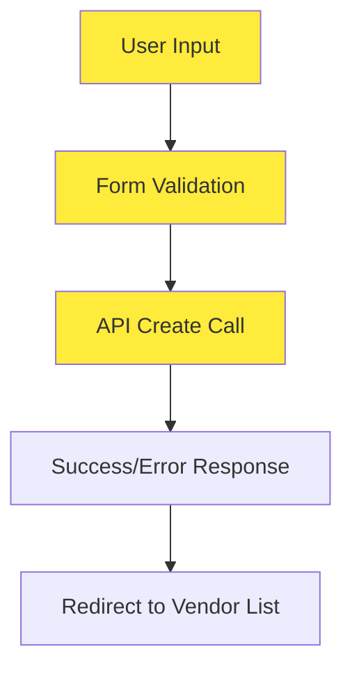
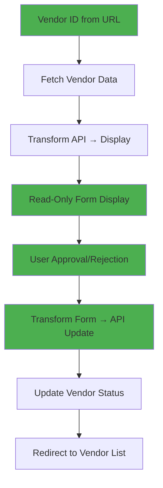

# Domestik Vendor Registration → Verification Conversion Plan

## 📋 Executive Summary

This document outlines the comprehensive transformation of the **Domestik Vendor Registration** system from a **create/edit workflow** to a **verification/approval workflow**, matching the simplicity and capability of the **International Vendor Verification** system while preserving the complex field requirements unique to domestic vendors.

### 🎯 Conversion Goals

- **Maintain Field Complexity**: Keep all domestik-specific fields and requirements
- **Simplify User Interaction**: Convert from editable forms to read-only display
- **Add Approval Capability**: Implement approve/reject functionality like international version
- **Preserve Vendor Types**: Maintain 4 vendor types (ATPM, Manufaktur, Distributor, Importir)
- **Follow International Pattern**: Use same URL routing, breadcrumb navigation, and permission system

---

## 🏗️ Current vs Target Architecture

### Current State (Registration)


### Target State (Verification)


---

## 🔧 Detailed Implementation Plan

### Phase 1: API Services & Data Layer

#### 1.1 Create Domestic Vendor Detail Service

**File**: `src/services/vendor-domestik/getSellerDetailDomestic.ts`

```typescript
export interface SellerDetailDomesticResponse {
  id: string;
  // Account Information
  accountInformation: {
    email: string;
    phoneNumber: string;
    picName: string;
    emailPic: string;
    picPhoneNumber: string;
    position: string;
    companyDetail: {
      name: string;
      businessType: { id: string; name: string };
      productType: { id: string; name: string };
      addressDetail: string;
      location: string;
      city: string;
      cityId: number;
      province: string;
      provinceId: number;
      postalCode: string;
      latitude: number;
      longitude: number;
      logoPath: string;
      companyPhones: Array<{ phoneNumber: string; isPrimary: boolean }>;
    };
    // Domestik specific
    npwp: string;
    sppkpFile: string;
  };

  // Legal Information
  legalitas: {
    documents: Array<{
      documentType: "nib" | "deed_of_establishment" | "kemenkumham_decree" | "latest_amendment_deed";
      filePath: string;
      issueDate: string;
    }>;
    directorInfo: {
      icNo: string;
      directorName: string;
      directorPosition: string;
      fileIc: string;
      directorStatementLetter: string;
    };
    brands: Array<{
      id: string;
      name: string;
      type: "atpm" | "manufaktur" | "distributor" | "importir";
      documents: Array<{
        documentType: string;
        filePath: string;
        issueDate: string;
      }>;
    }>;
    productCataloguePath: string;
  };

  // Contract Information
  contract: {
    bankAccount: {
      swiftBicCode: string;
      accountNumber: string;
      accountHolder: string;
      financePicPhoneNumber: string;
    };
    contractDetails: {
      agreementNumber: string;
      agreementFilePath: string;
      startDate: string;
      duration: number;
      notes: string;
    };
    contractHistory?: Array<{
      changedAt: string;
      agreementNumber: string;
      agreementUrl: string;
      notes: string;
      duration: number;
    }>;
    // Approval fields
    respon: "approve" | "reject" | "pending";
    rejectionNote?: string;
  };

  // Metadata
  status: "pending_approval" | "verified" | "rejected";
  createdAt: string;
  updatedAt: string;
}

export const useGetSellerDetailDomestic = (vendorId: string) => {
  return useQuery({
    queryKey: ["seller-detail-domestic", vendorId],
    queryFn: () => getSellerDetailDomestic(vendorId),
    enabled: !!vendorId,
    staleTime: 5 * 60 * 1000, // 5 minutes
  });
};
```

#### 1.2 Create Domestic Vendor Update Service

**File**: `src/services/vendor-domestik/updateSellerDomestic.ts`

```typescript
export interface PayloadUpdateSellerDomestic {
  id: string;
  // Account Information (for potential updates)
  email?: string;
  phoneNumber?: string;
  // ... other account fields

  // Approval fields
  status: "verified" | "rejected";
  rejectionNote?: string;
  contract: {
    // ... contract details
    respon: "approve" | "reject";
    rejectionNote?: string;
  };
}

export const updateSellerDomestic = async (
  payload: PayloadUpdateSellerDomestic
): Promise<UpdateResponse> => {
  try {
    const response = await api.put(`/vendor-domestik/${payload.id}`, payload);
    return {
      success: true,
      message: "Vendor berhasil diperbarui",
      data: response.data,
    };
  } catch (error) {
    return {
      success: false,
      message: handleApiError(error),
    };
  }
};
```

### Phase 2: Type System Updates

#### 2.1 Update Types for Verification Workflow

**File**: `src/container/VerifikasiVendorDomestik/components/types.ts`

```typescript
// Add new types for verification workflow
export interface FormState {
  1: UpdateVendorFormInput | null;
  2: UpdateLegalitasFormInput | null;
  3: UpdateContractFormInput | null;
}

export interface VendorUpdateState {
  vendorId: string | null;
  isLoading: boolean;
  isUpdating: boolean;
  error: string | null;
}

// Update Contract Schema with approval fields
export const updateContractSchema = v.variant("respon", [
  // Approve variant
  v.object({
    ...baseContractFields,
    respon: v.optional(v.literal("approve")),
    rejectionNote: v.optional(v.string()),
  }),
  // Reject variant
  v.object({
    ...baseContractFields,
    respon: v.literal("reject"),
    rejectionNote: v.pipe(
      v.string("Rejection note must be a string."),
      v.nonEmpty(VALIDATION_MESSAGES.REQUIRED)
    ),
  }),
]);

export type UpdateContractFormInput = v.InferInput<typeof updateContractSchema>;

// Add transformation functions
export const transformApiDataToForm = (apiData: SellerDetailDomesticResponse): FormState => {
  return {
    1: {
      email: apiData.accountInformation.email,
      phoneNumber: apiData.accountInformation.phoneNumber,
      picName: apiData.accountInformation.picName,
      emailPic: apiData.accountInformation.emailPic,
      picPhoneNumber: apiData.accountInformation.picPhoneNumber,
      position: apiData.accountInformation.position,
      companyName: apiData.accountInformation.companyDetail.name,
      companyType: String(apiData.accountInformation.companyDetail.businessType.id),
      productType: apiData.accountInformation.companyDetail.productType.id,
      addressDetail: apiData.accountInformation.companyDetail.addressDetail,
      companyLocationGmaps: apiData.accountInformation.companyDetail.location,
      city: apiData.accountInformation.companyDetail.city,
      cityId: apiData.accountInformation.companyDetail.cityId,
      province: apiData.accountInformation.companyDetail.province,
      provinceId: apiData.accountInformation.companyDetail.provinceId,
      postalCode: apiData.accountInformation.companyDetail.postalCode,
      pinPoint: {
        latitude: apiData.accountInformation.companyDetail.latitude,
        longitude: apiData.accountInformation.companyDetail.longitude,
      },
      companyLogo: apiData.accountInformation.companyDetail.logoPath,
      companyPhoneNumbers: apiData.accountInformation.companyDetail.companyPhones.map(
        phone => ({ value: phone.phoneNumber })
      ),
      // Domestik specific fields
      npwp: apiData.accountInformation.npwp,
      sppkpFile: apiData.accountInformation.sppkpFile,
    },
    2: {
      // Map legal documents
      nibFile: apiData.legalitas.documents.find(doc => doc.documentType === "nib")?.filePath || "",
      incorporationCertificateFile: apiData.legalitas.documents.find(
        doc => doc.documentType === "deed_of_establishment"
      )?.filePath || "",
      skKemenkumhamFile: apiData.legalitas.documents.find(
        doc => doc.documentType === "kemenkumham_decree"
      )?.filePath || "",
      deedOfChangeFile: apiData.legalitas.documents.find(
        doc => doc.documentType === "latest_amendment_deed"
      )?.filePath || "",
      skKemenkumhamChangeFile: apiData.legalitas.documents.find(
        doc => doc.documentType === "latest_kemenkumham_decree"
      )?.filePath || "",

      // Director information
      directorIdFile: apiData.legalitas.directorInfo.fileIc,
      directorIdNumber: apiData.legalitas.directorInfo.icNo,
      directorName: apiData.legalitas.directorInfo.directorName,
      directorPosition: apiData.legalitas.directorInfo.directorPosition,
      directorStatementFile: apiData.legalitas.directorInfo.directorStatementLetter,

      // Dynamic brands based on type
      brands: apiData.legalitas.brands.map(brand => {
        const baseBrand = {
          id: brand.id,
        };

        // Type-specific transformations
        switch (brand.type) {
          case "manufaktur":
            return {
              ...baseBrand,
              brand: brand.name,
              intellectualPropertyFile: brand.documents.find(
                doc => doc.documentType === "intellectual_property"
              )?.filePath || "",
              registrationDate: brand.documents.find(
                doc => doc.documentType === "intellectual_property"
              )?.issueDate || "",
              certificateOfOriginFile: brand.documents.find(
                doc => doc.documentType === "certificate_of_origin"
              )?.filePath || "",
            } as BrandManufakturInput;

          case "atpm":
            return {
              ...baseBrand,
              brandName: brand.name,
              brandOwnershipFile: brand.documents.find(
                doc => doc.documentType === "trademark_certificate"
              )?.filePath || "",
              brandRegistrationDate: brand.documents.find(
                doc => doc.documentType === "trademark_certificate"
              )?.issueDate || "",
            } as BrandAtpmInput;

          case "distributor":
            return {
              ...baseBrand,
              brandName: brand.name,
              brandOwnershipFile: brand.documents.find(
                doc => doc.documentType === "trademark_certificate"
              )?.filePath || "",
              brandRegistrationDate: brand.documents.find(
                doc => doc.documentType === "trademark_certificate"
              )?.issueDate || "",
              agencyAppointmentFile: brand.documents.find(
                doc => doc.documentType === "agency_appointment"
              )?.filePath || "",
            } as BrandDistributorInput;

          case "importir":
            return {
              ...baseBrand,
              brandName: brand.name,
              brandOwnershipFile: brand.documents.find(
                doc => doc.documentType === "trademark_certificate"
              )?.filePath || "",
              brandRegistrationDate: brand.documents.find(
                doc => doc.documentType === "trademark_certificate"
              )?.issueDate || "",
              cooFile: brand.documents.find(
                doc => doc.documentType === "certificate_of_origin"
              )?.filePath || "",
            } as BrandImportirInput;
        }
      }),

      productCatalogFile: apiData.legalitas.productCataloguePath,
    },
    3: {
      // Bank account details
      swiftBicCode: apiData.contract.bankAccount.swiftBicCode,
      accountNumber: apiData.contract.bankAccount.accountNumber,
      accountHolderName: apiData.contract.bankAccount.accountHolder,
      picFinancePhoneNumber: apiData.contract.bankAccount.financePicPhoneNumber,

      // Contract details
      agreementNumber: apiData.contract.contractDetails.agreementNumber,
      agreementFile: apiData.contract.contractDetails.agreementFilePath,
      cooperationNotes: apiData.contract.contractDetails.notes,
      agreementDate: apiData.contract.contractDetails.startDate.split("T")[0],
      contractDuration: apiData.contract.contractDetails.duration,

      // Approval fields
      respon: apiData.contract.respon || "pending",
      rejectionNote: apiData.contract.rejectionNote || "",
    },
  };
};

// Transform form data to API payload for updates
export const transformToApiPayload = (
  accountData: UpdateVendorFormInput,
  legalitasData: UpdateLegalitasFormInput,
  contractData: UpdateContractFormInput
): PayloadUpdateSellerDomestic => {
  // Implementation similar to current transformToApiPayload but focused on approval

  return {
    id: "", // Will be set from URL params
    status: contractData?.respon === "approve" ? "verified" : "rejected",
    rejectionNote: contractData?.rejectionNote || "",
    contract: {
      agreementNumber: contractData.agreementNumber,
      startDate: contractData.agreementDate,
      swiftBicCode: contractData.swiftBicCode,
      accountNumber: contractData.accountNumber,
      accountHolder: contractData.accountHolderName,
      financePicPhoneNumber: contractData.picFinancePhoneNumber,
      agreementFilePath: contractData.agreementFile || "",
      contractDuration: contractData.contractDuration,
      notes: contractData.cooperationNotes || "",
      respon: contractData.respon || "pending",
      rejectionNote: contractData.rejectionNote || "",
    },
  };
};
```

### Phase 3: Main Container Transformation

#### 3.1 Update Main Container Logic

**File**: `src/container/VerifikasiVendorDomestik/VerifikasiVendorDomestik.tsx`

```typescript
"use client";

import { useParams, useRouter } from "next/navigation";
import { useEffect, useState } from "react";

import { toast } from "@muatmuat/ui/Toaster";

import { useGetSellerDetailDomestic } from "@/services/vendor-domestik/getSellerDetailDomestic";
import { updateSellerDomestic, PayloadUpdateSellerDomestic } from "@/services/vendor-domestik/updateSellerDomestic";
import { useGetProfile } from "@/services/globals/getProfile";

import { BreadcrumbMini } from "@/components/BreadcrumbMini/BreadcrumbMini";
import { ModalSuccess } from "@/components/Modal/ModalSuccess";
import { ModalWarning } from "@/components/Modal/ModalWarning";
import PageTitle from "@/components/PageTitle/PageTitle";

import FormAccountInformation from "./components/FormAccountInformation";
import FormKontrak from "./components/FormKontrak";
import FormLegalitas from "./components/FormLegalitas";
import {
  UpdateContractFormInput,
  FormState,
  transformApiDataToForm,
  transformToApiPayload,
} from "./components/types";

// TypeScript interfaces
interface BreadcrumbItem {
  text: string;
  active: boolean;
}

interface VendorUpdateState {
  vendorId: string | null;
  isLoading: boolean;
  isUpdating: boolean;
  error: string | null;
}

const VerifikasiVendorDomestik = () => {
  const params = useParams();
  const router = useRouter();
  const vendorId = params.id as string;

  const [step, setStep] = useState<number>(1);
  const [updateState, setUpdateState] = useState<VendorUpdateState>({
    vendorId: vendorId,
    isLoading: true,
    isUpdating: false,
    error: null,
  });

  // Initialize with empty form values
  const [formValues, setFormValues] = useState<FormState>({
    1: null,
    2: null,
    3: null,
  });

  // Load vendor data using API hook
  const {
    data: vendorData,
    error: vendorError,
    isLoading: vendorLoading,
  } = useGetSellerDetailDomestic(vendorId);

  // Handle API errors with user-friendly messages
  const handleApiError = (error: unknown): string => {
    if (error instanceof Error) {
      if (error.message.includes("Network Error") || error.message.includes("fetch")) {
        return "Terjadi kesalahan jaringan. Silakan periksa koneksi internet Anda.";
      }
      if (error.message.includes("400")) {
        return "Data yang dikirim tidak valid. Silakan periksa kembali formulir.";
      }
      if (error.message.includes("401")) {
        return "Sesi Anda telah berakhir. Silakan login kembali.";
      }
      if (error.message.includes("403")) {
        return "Anda tidak memiliki izin untuk melakukan aksi ini.";
      }
      if (error.message.includes("404")) {
        return "Vendor tidak ditemukan.";
      }
      if (error.message.includes("409")) {
        return "Terjadi konflik data. Silakan coba lagi.";
      }
      if (error.message.includes("422") || error.message.includes("validation")) {
        return "Validasi data gagal. Silakan periksa kembali data yang dimasukkan.";
      }
      if (error.message.includes("500")) {
        return "Terjadi kesalahan pada server. Silakan coba lagi nanti.";
      }
      return error.message || "Terjadi kesalahan yang tidak diketahui.";
    }
    return "Terjadi kesalahan yang tidak diketahui. Silakan coba lagi.";
  };

  // Update vendor data
  const updateVendor = async (
    accountData: any,
    legalitasData: any,
    contractData: UpdateContractFormInput
  ): Promise<any> => {
    try {
      setUpdateState((prev) => ({ ...prev, isUpdating: true, error: null }));

      if (!vendorId) {
        throw new Error("Vendor ID is required for updates");
      }

      const apiPayload = transformToApiPayload(
        accountData,
        legalitasData,
        contractData
      );

      // Set vendor ID
      apiPayload.id = vendorId;

      const response = await updateSellerDomestic(apiPayload);

      if (!response) {
        throw new Error("Tidak ada respons dari server. Silakan coba lagi.");
      }

      if (response.success === false) {
        throw new Error(response.message || "Gagal memverifikasi vendor");
      }

      return response;
    } catch (error) {
      const errorMessage = handleApiError(error);
      setUpdateState((prev) => ({ ...prev, error: errorMessage }));
      return null;
    } finally {
      setUpdateState((prev) => ({ ...prev, isUpdating: false }));
    }
  };

  // Update form values when API data loads
  useEffect(() => {
    if (vendorLoading) return;

    if (vendorError) {
      toast.error("Tidak dapat menemukan data vendor. Vendor tidak ditemukan.");
      router.push("/vendor-domestik/vendor-terdaftar");
      return;
    }

    if (!vendorData || Object.keys(vendorData).length === 0) {
      toast.error("Tidak dapat menemukan data vendor. Vendor tidak ditemukan.");
      router.push("/vendor-domestik/vendor-terdaftar");
      return;
    }

    try {
      const formValuesData = transformApiDataToForm(vendorData);
      setFormValues(formValuesData);
    } catch (_error) {
      console.error("[DetailVendorDomestic] Error transforming data:", _error);
      toast.error("Gagal memproses data vendor.");
    }
  }, [vendorData, vendorError, vendorLoading, vendorId, router]);

  // Breadcrumb data based on current step
  const breadcrumbData: BreadcrumbItem[] = [
    { text: "Informasi Akun", active: step === 1 },
    { text: "Legalitas", active: step === 2 },
    { text: "Kontrak", active: step === 3 },
  ];

  return (
    <div className="mx-auto flex w-full max-w-[1230px] flex-col items-center">
      {/* Header */}
      <div className="flex items-center justify-between gap-2 self-stretch px-[15px] pb-[10px] pt-[18px]">
        <PageTitle className="self-start">
          Verifikasi Vendor Domestik
        </PageTitle>
      </div>

      {/* Breadcrumb Navigation */}
      <BreadcrumbMini data={breadcrumbData} setStep={setStep} />

      {/* Content Area */}
      <div className="self-stretch">
        {step === 1 ? (
          <FormAccountInformation
            defaultValues={formValues[1] || undefined}
            onNext={() => setStep(2)}
          />
        ) : step === 2 ? (
          <FormLegalitas
            defaultValues={formValues[2] || undefined}
            onBack={() => setStep(1)}
            onNext={() => setStep(3)}
          />
        ) : step === 3 ? (
          <FormKontrak
            defaultValues={formValues[3] || undefined}
            onBack={() => setStep(2)}
            onSubmit={async (values: UpdateContractFormInput) => {
              try {
                await updateVendor(
                  formValues[1], // Account Information
                  formValues[2], // Legalitas Information
                  values // Contract Information
                );

                toast.success("Vendor berhasil diverifikasi!");
                router.push("/vendor-domestik/vendor-terdaftar");
              } catch {
                if (updateState.error) {
                  toast.error(updateState.error);
                }
              }
            }}
            contractHistory={vendorData?.contract?.contractHistory}
          />
        ) : null}
      </div>
    </div>
  );
};

export default VerifikasiVendorDomestik;
```

### Phase 4: Form Component Transformations

#### 4.1 Transform FormAccountInformation to Read-Only Display

**File**: `src/container/VerifikasiVendorDomestik/components/FormAccountInformation.tsx`

```typescript
"use client";

import React from "react";

import { cn } from "@muatmuat/lib/utils";
import { Button } from "@muatmuat/ui/Button";
import { FileUploadButton, Input, PhoneInputBO } from "@muatmuat/ui/Form";

import { useGetMasterBusinessEntitiesDomestic } from "@/services/vendor-domestik/master/getMasterBusinessEntitiesDomestic";
import { useGetMasterProductTypesDomestic } from "@/services/vendor-domestik/master/getMasterProductTypesDomestic";

import { UpdateVendorFormInput } from "./types";

interface FormAccountInformationProps {
  defaultValues?: Partial<UpdateVendorFormInput>;
  onNext?: () => void;
}

const FormAccountInformation: React.FC<FormAccountInformationProps> = ({
  defaultValues,
  onNext,
}) => {
  const { data: productTypesData } = useGetMasterProductTypesDomestic();
  const { data: businessEntitiesData } = useGetMasterBusinessEntitiesDomestic();

  // Transform grades data into select options for display
  const getProductTypeName = (productId: string) => {
    if (!productTypesData || !Array.isArray(productTypesData)) return productId;
    const product = productTypesData.find((grade) => grade.id === productId);
    return product ? product.grade_name : productId;
  };

  // Transform business entities data for display
  const getCompanyTypeName = (companyType: string) => {
    if (!businessEntitiesData || !Array.isArray(businessEntitiesData))
      return companyType;
    const entity = businessEntitiesData.find(
      (entity) => entity.id === companyType
    );
    return entity ? entity.name_id : companyType;
  };

  // Helper Row Component
  const FormRow = ({ label, required, children, className = "" }) => (
    <>
      <label
        className={cn(
          "pt-[7px] font-['Avenir_Next_LT_Pro'] text-[14px] font-semibold text-[#555555]",
          className
        )}
      >
        {label}
        {required && <span>*</span>}
      </label>
      <div className="w-full">{children}</div>
    </>
  );

  return (
    <div className="flex w-full flex-1 flex-col gap-[10px]">
      {/* --- Account Information Section --- */}
      <div className="space-y-[21px] px-[25px]">
        <h2 className="font-['Avenir_Next_LT_Pro'] text-[15px] font-medium text-[#1B1B1B]">
          Informasi Akun
        </h2>
        <div className="grid grid-cols-1 gap-x-[10px] gap-y-[21px] pl-2.5 md:grid-cols-[230px_1fr]">
          <FormRow label="Email" required>
            <Input value={defaultValues?.email || ""} disabled />
          </FormRow>
          <FormRow label="No. Whatsapp" required>
            <PhoneInputBO
              value={defaultValues?.phoneNumber || ""}
              disabled
              defaultCountry="ID"
            />
          </FormRow>
        </div>
      </div>

      {/* --- PIC Information Section --- */}
      <div className="space-y-[21px] px-[25px]">
        <h2 className="font-['Avenir_Next_LT_Pro'] text-[15px] font-medium text-[#1B1B1B]">
          Informasi PIC
        </h2>
        <div className="grid grid-cols-1 gap-x-[10px] gap-y-[21px] pl-2.5 md:grid-cols-[230px_1fr]">
          <FormRow label="Nama PIC" required>
            <Input value={defaultValues?.picName || ""} disabled />
          </FormRow>
          <FormRow label="Email PIC" required>
            <Input
              value={defaultValues?.emailPic || ""}
              type="email"
              disabled
            />
          </FormRow>
          <FormRow label="No. Whatsapp PIC" required>
            <PhoneInputBO
              value={defaultValues?.picPhoneNumber || ""}
              disabled
              defaultCountry="ID"
            />
          </FormRow>
          <FormRow label="Jabatan" required>
            <Input value={defaultValues?.position || ""} disabled />
          </FormRow>
        </div>
      </div>

      {/* --- Company Information Section --- */}
      <div className="space-y-[21px] px-[25px]">
        <h2 className="font-['Avenir_Next_LT_Pro'] text-[15px] font-medium text-[#1B1B1B]">
          Informasi Perusahaan
        </h2>
        <div className="grid grid-cols-1 gap-x-[10px] gap-y-[21px] pl-2.5 md:grid-cols-[230px_1fr]">
          <FormRow label="Nama Perusahaan" required>
            <Input value={defaultValues?.companyName || ""} disabled />
          </FormRow>
          <FormRow label="Badan Usaha" required>
            <Input
              value={getCompanyTypeName(defaultValues?.companyType || "")}
              disabled
            />
          </FormRow>
          <FormRow label="Kategori Usaha" required>
            <Input
              value={getProductTypeName(defaultValues?.productType || "")}
              disabled
            />
          </FormRow>
          <FormRow label="Logo Perusahaan" required>
            <FileUploadButton
              value={defaultValues?.companyLogo || ""}
              disabled
              variant="muatparts-primary-secondary"
            />
          </FormRow>
          <FormRow label="Detail Alamat" required>
            <Input
              value={defaultValues?.addressDetail || ""}
              disabled
              appearance={{ inputClassName: "min-h-[60px]" }}
            />
          </FormRow>
          <FormRow label="Lokasi Perusahaan (Gmaps)" required>
            <Input value={defaultValues?.companyLocationGmaps || ""} disabled />
          </FormRow>
          <FormRow label="Kecamatan" required>
            <Input value={defaultValues?.kecamatan || ""} disabled />
          </FormRow>
          <FormRow label="Kabupaten/Kota" required>
            <Input value={defaultValues?.city || ""} disabled />
          </FormRow>
          <FormRow label="Provinsi" required>
            <Input value={defaultValues?.province || ""} disabled />
          </FormRow>
          <FormRow label="Kode Pos" required>
            <Input value={defaultValues?.postalCode || ""} disabled />
          </FormRow>
          <FormRow label="Pin Point" required>
            <Input
              value={
                defaultValues?.pinPoint
                  ? `${defaultValues.pinPoint.latitude}, ${defaultValues.pinPoint.longitude}`
                  : ""
              }
              disabled
            />
          </FormRow>
          <FormRow label="No. Telepon Perusahaan" required>
            <div className="space-y-3">
              {defaultValues?.companyPhoneNumbers?.map((phone, index) => (
                <div key={index} className="flex gap-5">
                  <PhoneInputBO
                    value={phone.value}
                    disabled
                    defaultCountry="ID"
                  />
                </div>
              )) || <Input value="" disabled />}
            </div>
          </FormRow>
          <FormRow label="NPWP" required>
            <Input value={defaultValues?.npwp || ""} disabled />
          </FormRow>
          <FormRow label="SPPKP" required>
            <FileUploadButton
              value={defaultValues?.sppkpFile || ""}
              disabled
              variant="muatparts-primary-secondary"
            />
          </FormRow>
        </div>
      </div>

      {/* --- Footer Button --- */}
      <div className="mt-8 flex w-full justify-center gap-4 px-[25px]">
        <Button
          type="button"
          variant="muatparts-primary"
          className="h-8 rounded-[20px] bg-[#176CF7] px-6 py-[7px] text-[14px] font-semibold text-white"
          onClick={onNext}
        >
          Selanjutnya
        </Button>
      </div>
    </div>
  );
};

export default FormAccountInformation;
```

#### 4.2 Transform FormLegalitas to Read-Only Display

**File**: `src/container/VerifikasiVendorDomestik/components/FormLegalitas.tsx`

```typescript
"use client";

import React from "react";

import { Button } from "@muatmuat/ui/Button";
import { FileUploadButton, Input } from "@muatmuat/ui/Form";

import { UpdateLegalitasFormInput, FormType } from "./types";

interface FormLegalitasProps {
  defaultValues?: Partial<UpdateLegalitasFormInput>;
  onBack?: () => void;
  onNext?: () => void;
  type?: FormType;
}

// Brand Display Components for different vendor types
const BrandSectionDisplay = ({ brand, type }) => {
  const RequiredIndicator = ({ isRequired }) =>
    isRequired ? <span>*</span> : null;

  // Render fields based on vendor type
  const renderBrandFields = () => {
    switch (type) {
      case "manufaktur":
        return (
          <>
            <div className="grid grid-cols-1 items-center gap-4 md:grid-cols-[230px_1fr]">
              <label className="text-[14px] font-semibold text-[#868686]">
                Brand
                <RequiredIndicator isRequired={true} />
              </label>
              <Input value={brand.brand || ""} disabled />

              <label className="text-[14px] font-semibold text-[#868686]">
                Intellectual Property (IP) / IPR
              </label>
              <FileUploadButton
                value={brand.intellectualPropertyFile || ""}
                disabled
                variant="muatparts-primary-secondary"
              />

              <label className="text-[14px] font-semibold text-[#868686]">
                Tanggal Registrasi IP
                <RequiredIndicator isRequired={true} />
              </label>
              <Input value={brand.registrationDate || ""} disabled />

              <label className="text-[14px] font-semibold text-[#868686]">
                Surat Keterangan Asal (COO)
                <RequiredIndicator isRequired={true} />
              </label>
              <FileUploadButton
                value={brand.certificateOfOriginFile || ""}
                disabled
                variant="muatparts-primary-secondary"
              />
            </div>
          </>
        );

      case "atpm":
        return (
          <>
            <div className="grid grid-cols-1 items-center gap-4 md:grid-cols-[230px_1fr]">
              <label className="text-[14px] font-semibold text-[#868686]">
                Merek
                <RequiredIndicator isRequired={true} />
              </label>
              <Input value={brand.brandName || ""} disabled />

              <label className="text-[14px] font-semibold text-[#868686]">
                Surat Pemegang Merek Dagang
                <RequiredIndicator isRequired={true} />
              </label>
              <FileUploadButton
                value={brand.brandOwnershipFile || ""}
                disabled
                variant="muatparts-primary-secondary"
              />

              <label className="text-[14px] font-semibold text-[#868686]">
                Tanggal Diterbitkan
                <RequiredIndicator isRequired={true} />
              </label>
              <Input value={brand.brandRegistrationDate || ""} disabled />
            </div>
          </>
        );

      case "distributor":
        return (
          <>
            <div className="grid grid-cols-1 items-center gap-4 md:grid-cols-[230px_1fr]">
              <label className="text-[14px] font-semibold text-[#868686]">
                Merek
                <RequiredIndicator isRequired={true} />
              </label>
              <Input value={brand.brandName || ""} disabled />

              <label className="text-[14px] font-semibold text-[#868686]">
                Surat Pemegang Merek Dagang
                <RequiredIndicator isRequired={true} />
              </label>
              <FileUploadButton
                value={brand.brandOwnershipFile || ""}
                disabled
                variant="muatparts-primary-secondary"
              />

              <label className="text-[14px] font-semibold text-[#868686]">
                Tanggal Diterbitkan
                <RequiredIndicator isRequired={true} />
              </label>
              <Input value={brand.brandRegistrationDate || ""} disabled />

              <label className="text-[14px] font-semibold text-[#868686]">
                Surat Penunjukkan Keagenan
                <RequiredIndicator isRequired={true} />
              </label>
              <FileUploadButton
                value={brand.agencyAppointmentFile || ""}
                disabled
                variant="muatparts-primary-secondary"
              />
            </div>
          </>
        );

      case "importir":
        return (
          <>
            <div className="grid grid-cols-1 items-center gap-4 md:grid-cols-[230px_1fr]">
              <label className="text-[14px] font-semibold text-[#868686]">
                Merek
                <RequiredIndicator isRequired={true} />
              </label>
              <Input value={brand.brandName || ""} disabled />

              <label className="text-[14px] font-semibold text-[#868686]">
                Surat Pemegang Merek Dagang
                <RequiredIndicator isRequired={true} />
              </label>
              <FileUploadButton
                value={brand.brandOwnershipFile || ""}
                disabled
                variant="muatparts-primary-secondary"
              />

              <label className="text-[14px] font-semibold text-[#868686]">
                Tanggal Diterbitkan
                <RequiredIndicator isRequired={true} />
              </label>
              <Input value={brand.brandRegistrationDate || ""} disabled />

              <label className="text-[14px] font-semibold text-[#868686]">
                Surat Keterangan Asal (COO)
                <RequiredIndicator isRequired={true} />
              </label>
              <FileUploadButton
                value={brand.cooFile || ""}
                disabled
                variant="muatparts-primary-secondary"
              />
            </div>
          </>
        );

      default:
        return null;
    }
  };

  return (
    <div className="w-full">
      <div className="space-y-4 rounded-[10px] border border-[#A8A8A8] px-8 py-5">
        {renderBrandFields()}
      </div>
    </div>
  );
};

// --- Main Form Component ---
const FormLegalitas: React.FC<FormLegalitasProps> = ({
  defaultValues,
  onBack,
  onNext,
  type = "atpm", // Default type for display
}) => {
  // Helper for consistent form layout
  const FormRow = ({ label, required, children }) => {
    return (
      <React.Fragment>
        <label className="pt-2 text-[14px] font-semibold leading-[140%] text-[#868686]">
          {label.replace("*", "").trim()}
          {required && <span>*</span>}
        </label>
        <div className="w-full">{children}</div>
      </React.Fragment>
    );
  };

  return (
    <div className="flex w-full flex-1 flex-col gap-[16px] px-[25px] pt-[18px]">
      {/* --- Business Legal Entity --- */}
      <div className="space-y-[16px]">
        <h2 className="text-[15px] font-medium text-[#1B1B1B]">
          Legalitas Badan Usaha
        </h2>
        <div className="grid grid-cols-1 gap-x-[21px] gap-y-4 pl-[10px] md:grid-cols-[230px_1fr]">
          <FormRow label="NIB" required>
            <FileUploadButton
              value={defaultValues?.nibFile || ""}
              disabled
              variant="muatparts-primary-secondary"
            />
          </FormRow>
          <FormRow label="Akta Pendirian" required>
            <FileUploadButton
              value={defaultValues?.incorporationCertificateFile || ""}
              disabled
              variant="muatparts-primary-secondary"
            />
          </FormRow>
          <FormRow label="SK Kemenkumham" required>
            <FileUploadButton
              value={defaultValues?.skKemenkumhamFile || ""}
              disabled
              variant="muatparts-primary-secondary"
            />
          </FormRow>
          <FormRow label="Akta Perubahan">
            <FileUploadButton
              value={defaultValues?.deedOfChangeFile || ""}
              disabled
              variant="muatparts-primary-secondary"
            />
          </FormRow>
          <FormRow label="SK Kemenkumham Perubahan">
            <FileUploadButton
              value={defaultValues?.skKemenkumhamChangeFile || ""}
              disabled
              variant="muatparts-primary-secondary"
            />
          </FormRow>
        </div>
      </div>

      {/* --- Director Information --- */}
      <div className="space-y-[16px]">
        <h2 className="text-[15px] font-medium text-[#1B1B1B]">
          Identitas Direksi
        </h2>
        <div className="grid grid-cols-1 items-center gap-x-[21px] gap-y-4 pl-[10px] md:grid-cols-[230px_1fr]">
          <FormRow label="KTP Direksi" required>
            <FileUploadButton
              value={defaultValues?.directorIdFile || ""}
              disabled
              variant="muatparts-primary-secondary"
            />
          </FormRow>
          <FormRow label="No. Identitas Direksi" required>
            <Input
              value={defaultValues?.directorIdNumber || ""}
              disabled
              appearance={{ inputClassName: "text-[12px]" }}
            />
          </FormRow>
          <FormRow label="Nama Direksi" required>
            <Input
              value={defaultValues?.directorName || ""}
              disabled
              appearance={{ inputClassName: "text-[12px]" }}
            />
          </FormRow>
          <FormRow label="Jabatan" required>
            <Input
              value={defaultValues?.directorPosition || ""}
              disabled
              appearance={{ inputClassName: "text-[12px]" }}
            />
          </FormRow>
          <FormRow label="Surat Pernyataan Direksi" required>
            <FileUploadButton
              value={defaultValues?.directorStatementFile || ""}
              disabled
              variant="muatparts-primary-secondary"
            />
          </FormRow>
        </div>
      </div>

      {/* --- Business Legality (Brands) --- */}
      <div className="space-y-[16px]">
        <h2 className="text-[15px] font-medium text-[#1B1B1B]">
          Legalitas Dagang
        </h2>
        <div className="flex flex-col items-center gap-4 pl-[10px]">
          {defaultValues?.brands?.map((brand, index) => (
            <BrandSectionDisplay
              key={index}
              brand={brand}
              type={type}
            />
          ))}
        </div>
      </div>

      {/* --- Product List --- */}
      <div className="space-y-[10px]">
        <h2 className="text-[15px] font-medium text-[#1B1B1B]">Daftar Produk</h2>
        <div className="grid grid-cols-1 items-center gap-x-[21px] gap-y-4 pl-[10px] md:grid-cols-[230px_1fr]">
          <FormRow label="Template Rencana Penjualan">
            <FileUploadButton
              value={defaultValues?.salesPlanTemplateFile || ""}
              disabled
              variant="muatparts-primary-secondary"
            />
          </FormRow>
        </div>
      </div>

      {/* --- Footer Buttons --- */}
      <div className="flex w-full justify-center gap-[10px] py-[18px]">
        <Button
          type="button"
          variant="muatparts-primary-secondary"
          className="h-8 w-[129px] rounded-[20px] border-[#176CF7] px-6 py-[7px] text-[14px] font-semibold text-[#176CF7]"
          onClick={onBack}
        >
          Sebelumnya
        </Button>
        <Button
          type="button"
          variant="muatparts-primary"
          className="h-8 w-[124px] rounded-[20px] bg-[#176CF7] px-6 py-[7px] text-[14px] font-semibold text-white"
          onClick={onNext}
        >
          Selanjutnya
        </Button>
      </div>
    </div>
  );
};

export default FormLegalitas;
```

#### 4.3 Transform FormKontrak to Approval Workflow

**File**: `src/container/VerifikasiVendorDomestik/components/FormKontrak.tsx`

```typescript
"use client";

import React, { useState } from "react";

import { valibotResolver } from "@hookform/resolvers/valibot";
import { cn } from "@muatmuat/lib/utils";
import { Button } from "@muatmuat/ui/Button";
import { FileUploadButton, Input, TextArea } from "@muatmuat/ui/Form";
import { RadioButton } from "@muatmuat/ui/Radio";
import { Controller, useForm, useWatch } from "react-hook-form";

import { useGetProfile } from "@/services/globals/getProfile";
import { uploadFileWithProgress } from "@/services/globals/useFileUpload";

import { DatePicker } from "@/components/Calendar/DatePicker";

import { UpdateContractFormInput, updateContractSchema } from "./types";

export interface FormKontrakProps {
  onSubmit: (values: UpdateContractFormInput) => void;
  onBack: () => void;
  defaultValues?: Partial<UpdateContractFormInput>;
  contractHistory?: Array<{
    changedAt: string;
    agreementNumber: string;
    agreementUrl: string;
    notes: string;
    duration: number;
  }>;
}

// --- Helper Row Component ---
interface FormRowProps {
  label: string;
  required?: boolean;
  children: React.ReactNode;
  className?: string;
}

const FormRow: React.FC<FormRowProps> = ({
  label,
  required,
  children,
  className = "",
}) => (
  <>
    <label
      className={cn(
        "text-[14px] font-semibold text-[#868686]",
        "leading-[140%]",
        "pt-[7px]", // Aligns with input padding
        className
      )}
    >
      {label}
      {required && <span className="text-error-500">*</span>}
    </label>
    <div className="w-full">{children}</div>
  </>
);

// --- Main Form Component ---
const FormKontrak: React.FC<FormKontrakProps> = ({
  defaultValues,
  onSubmit,
  onBack,
  contractHistory,
}) => {
  const [isCatatanModalOpen, setIsCatatanModalOpen] = useState(false);
  const [selectedCatatan, setSelectedCatatan] = useState("");

  const {
    register,
    control,
    handleSubmit,
    reset,
    formState: { errors, isSubmitting },
  } = useForm<UpdateContractFormInput>({
    resolver: valibotResolver(updateContractSchema),
    mode: "onSubmit", // Only validate on form submission
    reValidateMode: "onBlur", // Re-validate on blur after initial validation
    defaultValues: {
      swiftBicCode: "",
      accountNumber: "",
      accountHolderName: "",
      picFinancePhoneNumber: "",
      agreementNumber: "",
      agreementFile: "",
      cooperationNotes: "",
      agreementDate: "",
      contractDuration: 1,
      respon: "approve", // Default to approve
      rejectionNote: "",
      ...defaultValues,
    },
  });

  const responValue = useWatch({ control, name: "respon" });
  const { data: profile } = useGetProfile();

  // Reset form when defaultValues change
  React.useEffect(() => {
    if (defaultValues) {
      const processedDefaults = {
        ...defaultValues,
        // Ensure date is in 'YYYY-MM-DD' string format for DatePicker/Valibot
        agreementDate: defaultValues.agreementDate?.split("T")[0] || "",
        // Set default respon if provided, otherwise default to "approve"
        respon: defaultValues.respon || "approve",
        rejectionNote: defaultValues.rejectionNote || "",
      };
      reset(processedDefaults as UpdateContractFormInput);
    }
  }, [defaultValues, reset]);

  const onSubmitHandler = (data: UpdateContractFormInput) => {
    const processedData = {
      ...data,
      // Ensure date is in full ISO format if API needs it
      agreementDate: new Date(data.agreementDate).toISOString(),
    };
    if (onSubmit) {
      onSubmit(processedData as UpdateContractFormInput);
    } else {
      alert("Form submitted successfully!");
    }
  };

  const handleOpenCatatanModal = (catatan: string) => {
    setSelectedCatatan(catatan);
    setIsCatatanModalOpen(true);
  };

  return (
    <>
      <form
        onSubmit={handleSubmit(onSubmitHandler)}
        className="mt-4 flex w-full flex-1 flex-col gap-[16px] px-[25px] pt-[18px]"
      >
        {/* --- Bank Account Section --- */}
        <div className="space-y-[16px]">
          <h2 className="text-[15px] font-medium text-[#1B1B1B]">
            Bank Account
          </h2>
          <div className="grid grid-cols-1 items-center gap-x-[21px] gap-y-4 pl-[10px] md:grid-cols-[230px_1fr]">
            <FormRow label="SWIFT/BIC Code" required>
              <Input
                placeholder="Masukkan SWIFT/BIC Code"
                errorMessage={errors.swiftBicCode?.message}
                {...register("swiftBicCode")}
                appearance={{ inputClassName: "text-[12px]" }}
                disabled
              />
            </FormRow>
            <FormRow label="Account Number" required>
              <Input
                placeholder="Masukkan Nomor Rekening"
                errorMessage={errors.accountNumber?.message}
                {...register("accountNumber")}
                appearance={{ inputClassName: "text-[12px]" }}
                disabled
              />
            </FormRow>
            <FormRow label="Account Holder Name" required>
              <Input
                placeholder="Masukkan Nama Rekening"
                errorMessage={errors.accountHolderName?.message}
                {...register("accountHolderName")}
                appearance={{ inputClassName: "text-[12px]" }}
                disabled
              />
            </FormRow>
            <FormRow label="PIC Finance Phone Number" required>
              <Input
                placeholder="Masukkan Nomor PIC Finance"
                errorMessage={errors.picFinancePhoneNumber?.message}
                {...register("picFinancePhoneNumber")}
                appearance={{ inputClassName: "text-[12px]" }}
                disabled
              />
            </FormRow>
          </div>
        </div>

        {/* --- Kontrak Section --- */}
        <div className="space-y-[10px]">
          <h2 className="text-[15px] font-medium text-[#1B1B1B]">Kontrak</h2>
          <div className="grid grid-cols-1 gap-x-[21px] gap-y-4 pl-[10px] md:grid-cols-[230px_1fr]">
            <FormRow label="Nomor Perjanjian Kerjasama" required>
              <Input
                placeholder="Masukkan Nomor Perjanjian Kerjasama"
                errorMessage={errors.agreementNumber?.message}
                {...register("agreementNumber")}
                appearance={{ inputClassName: "text-[12px]" }}
                disabled
              />
            </FormRow>
            <FormRow label="Perjanjian Kerjasama" required>
              <Controller
                name="agreementFile"
                control={control}
                render={({ field, fieldState: { error } }) => (
                  <FileUploadButton
                    value={field.value as string | null}
                    onChange={field.onChange}
                    name={field.name}
                    errorMessage={error?.message}
                    accept={["jpg", "png", "pdf", "zip"]}
                    maxSize={5 * 1024 * 1024} // 5MB
                    onUpload={uploadFileWithProgress}
                    variant="muatparts-primary-secondary"
                    disabled
                  />
                )}
              />
            </FormRow>
            <FormRow
              label="Catatan Kerjasama"
              required={false}
              className="pt-[7px]" // Align with textarea padding
            >
              <TextArea
                placeholder="Masukkan Catatan"
                errorMessage={errors.cooperationNotes?.message}
                {...register("cooperationNotes")}
                appearance={{ inputClassName: "text-xs h-[45px]" }}
                disabled
              />
            </FormRow>
            <FormRow label="Tanggal Kerjasama" required>
              <Controller
                name="agreementDate"
                control={control}
                render={({ field, fieldState: { error } }) => (
                  <DatePicker
                    value={field.value ? new Date(field.value) : null}
                    onChange={(date) =>
                      field.onChange(
                        date ? date.toISOString().split("T")[0] : ""
                      )
                    }
                    placeholder="Pilih Tanggal"
                    errorMessage={error?.message}
                    className="h-8 w-full"
                    disabled
                  />
                )}
              />
            </FormRow>
            <FormRow label="Jangka Lama Kontrak" required>
              <div className="flex items-center gap-[21px]">
                <Input
                  type="number"
                  placeholder="Masukkan Jangka Lama Kontrak"
                  errorMessage={errors.contractDuration?.message}
                  {...register("contractDuration", { valueAsNumber: true })}
                  className="h-8 flex-1"
                  appearance={{ inputClassName: "text-[12px]" }}
                  disabled
                />
                <span className="text-[14px] font-semibold leading-[140%] text-[#868686]">
                  Tahun
                </span>
              </div>
            </FormRow>
          </div>

          {/* Contract History Table Section */}
          <div className="space-y-[10px] pl-[10px]">
            {contractHistory && contractHistory.length > 0 && (
              <div className="w-[782px] rounded-[10px] border border-[#A8A8A8] bg-white pb-[12px]">
                <div className="flex flex-col gap-[8px] px-[8px] pt-[8px]">
                  {/* Table Header Row */}
                  <div className="flex w-[766px] border-b border-[#C6CBD4]">
                    <div className="w-[141px]">
                      <div className="flex items-center gap-[8px] px-[8px] py-[5px]">
                        <span className="text-[12px] font-semibold italic text-[#868686]">
                          last update
                        </span>
                      </div>
                    </div>
                    <div className="w-[125px]">
                      <div className="flex items-center gap-[8px] px-[8px] py-[5px]">
                        <span className="text-[12px] font-semibold text-[#868686]">
                          Nomor PKS
                        </span>
                      </div>
                    </div>
                    <div className="w-[125px]">
                      <div className="flex items-center gap-[8px] px-[8px] py-[5px]">
                        <span className="text-[12px] font-semibold text-[#868686]">
                          Perjanjian Kerjasama
                        </span>
                      </div>
                    </div>
                    <div className="w-[125px]">
                      <div className="flex items-center gap-[8px] px-[8px] py-[5px]">
                        <span className="text-[12px] font-semibold text-[#868686]">
                          Catatan
                        </span>
                      </div>
                    </div>
                    <div className="w-[125px]">
                      <div className="flex items-center gap-[8px] px-[8px] py-[5px]">
                        <span className="text-[12px] font-semibold text-[#868686]">
                          Tanggal
                        </span>
                      </div>
                    </div>
                    <div className="w-[125px]">
                      <div className="flex items-center gap-[8px] px-[8px] py-[5px]">
                        <span className="text-[12px] font-semibold text-[#868686]">
                          Jangka Lama
                        </span>
                      </div>
                    </div>
                  </div>

                  {/* Table Data Rows */}
                  {contractHistory?.map((row, index, arr) => (
                    <React.Fragment key={index}>
                      <div className="flex w-[766px]">
                        <div className="w-[141px]">
                          <div className="flex items-center gap-[12px] px-[8px] py-[5px]">
                            <span className="flex-1 text-[12px] font-medium text-[#1B1B1B]">
                              {new Date(row.changedAt).toLocaleString("id-ID")}
                            </span>
                          </div>
                        </div>
                        <div className="w-[125px]">
                          <div className="flex items-center gap-[12px] px-[8px] py-[5px]">
                            <span className="flex-1 text-[12px] font-medium text-[#1B1B1B]">
                              {row.agreementNumber}
                            </span>
                          </div>
                        </div>
                        <div className="w-[125px]">
                          <div className="flex items-center gap-[12px] px-[8px] py-[5px]">
                            <a
                              href="#"
                              className="flex-1 text-[12px] font-medium text-[#39BB00] underline"
                            >
                              {row.agreementUrl?.split("/").pop() || "File.pdf"}
                            </a>
                          </div>
                        </div>
                        <div className="w-[125px]">
                          <div className="flex items-center gap-[12px] px-[8px] py-[5px]">
                            <button
                              type="button"
                              className="flex-1 cursor-pointer overflow-hidden text-ellipsis whitespace-nowrap text-left text-[12px] font-medium text-[#1B1B1B] underline"
                              onClick={() =>
                                handleOpenCatatanModal(row.notes || "")
                              }
                            >
                              {row.notes}
                            </button>
                          </div>
                        </div>
                        <div className="w-[125px]">
                          <div className="flex items-center gap-[12px] px-[8px] py-[5px]">
                            <span className="flex-1 text-[12px] font-medium text-[#1B1B1B]">
                              {new Date(row.changedAt).toLocaleString("id-ID")}
                            </span>
                          </div>
                        </div>
                        <div className="w-[125px]">
                          <div className="flex items-center gap-[12px] px-[8px] py-[5px]">
                            <span className="flex-1 text-[12px] font-medium text-[#1B1B1B]">
                              {row.duration} Tahun
                            </span>
                          </div>
                        </div>
                      </div>
                      {index < arr.length - 1 && (
                        <div className="h-px w-[766px] bg-[#C6CBD4]"></div>
                      )}
                    </React.Fragment>
                  ))}
                </div>
              </div>
            )}
          </div>
        </div>

        {/* --- Respon Section --- */}
        {profile?.permissions?.booleanPermissions?.VENDOR_DOMESTIK?.APPROVE && (
          <div className="space-y-[10px]">
            <h2 className="text-[15px] font-medium text-[#1B1B1B]">Respon</h2>
            <div className="grid grid-cols-1 items-start gap-x-[21px] gap-y-4 pl-[10px] md:grid-cols-[230px_1fr]">
              <FormRow label="Respon" required className="pt-2">
                <div className="flex w-full flex-col gap-4">
                  <Controller
                    name="respon"
                    control={control}
                    render={({ field }) => (
                      <div className="flex flex-col gap-[11px]">
                        <RadioButton
                          label="Approve"
                          value="approve"
                          checked={field.value === "approve"}
                          onChange={() => field.onChange("approve")}
                          classNameLabel="text-[12px] font-semibold text-[#2E2E2E]"
                        />
                        <RadioButton
                          label="Reject"
                          value="reject"
                          checked={field.value === "reject"}
                          onChange={() => field.onChange("reject")}
                          classNameLabel="text-[12px] font-semibold text-[#2E2E2E]"
                        />
                      </div>
                    )}
                  />
                  <Controller
                    name="rejectionNote"
                    control={control}
                    render={({ field, fieldState: { error } }) => (
                      <TextArea
                        placeholder="Masukkan Catatan Penolakan"
                        errorMessage={error?.message}
                        {...field}
                        className="pl-[27px]"
                        appearance={{
                          inputClassName: cn(
                            "h-[45px] text-xs",
                            error && "border-[#F71717]" // Add red border on error
                          ),
                        }}
                        disabled={responValue !== "reject"}
                      />
                    )}
                  />
                </div>
              </FormRow>
            </div>
          </div>
        )}

        {/* --- Footer Buttons --- */}
        <div className="flex w-full justify-center gap-[10px] py-[18px]">
          <Button
            type="button"
            variant="muatparts-primary-secondary"
            className="h-8 w-[129px] rounded-[20px] border-[#176CF7] px-6 py-[7px] text-[14px] font-semibold text-[#176CF7]"
            onClick={onBack}
          >
            Sebelumnya
          </Button>
          {profile?.permissions?.booleanPermissions?.VENDOR_DOMESTIK?.APPROVE && (
            <Button
              type="submit"
              variant="muatparts-primary"
              className="h-8 w-[97px] rounded-[20px] bg-[#176CF7] px-6 py-[7px] text-[14px] font-semibold text-white"
              disabled={isSubmitting}
            >
              {isSubmitting ? "Menyimpan..." : "Simpan"}
            </Button>
          )}
        </div>
      </form>
    </>
  );
};

export default FormKontrak;
```

### Phase 5: Routing and Navigation Updates

#### 5.1 Update URL Routing

**File**: `src/app/vendor-domestik/verifikasi/[id]/page.tsx` (new file)

```typescript
import VerifikasiVendorDomestik from "@/container/VerifikasiVendorDomestik/VerifikasiVendorDomestik";

const VerifikasiVendorDomestikPage = () => {
  return <VerifikasiVendorDomestik />;
};

export default VerifikasiVendorDomestikPage;
```

#### 5.2 Update Navigation Links

Update any links pointing to the domestic vendor registration to point to the verification workflow:

```typescript
// Update navigation from:
/vendor-domestik/register

// To verification workflow:
/vendor-domestik/verifikasi/[id]
```

### Phase 6: Testing and Validation

#### 6.1 Test Cases

1. **Data Loading Tests**
   - Verify vendor data loads correctly from API
   - Test transformation from API to display format
   - Validate error handling for missing vendors

2. **Navigation Tests**
   - Test breadcrumb navigation between steps
   - Verify previous/next button functionality
   - Test redirect on successful verification

3. **Approval Workflow Tests**
   - Test approve workflow with proper permission checks
   - Test reject workflow with required rejection notes
   - Validate API updates for both approval and rejection

4. **Display Accuracy Tests**
   - Verify all domestik-specific fields display correctly
   - Test vendor type-specific brand field display
   - Validate file upload display functionality

5. **Permission Tests**
   - Test approval section visibility with/without permissions
   - Verify non-authorized users cannot approve/reject
   - Test permission-based UI elements

#### 6.2 Browser Testing Matrix

| Browser | Data Loading | Form Display | Approval | Permissions |
|---------|--------------|--------------|---------|--------------|
| Chrome | ✅ | ✅ | ✅ | ✅ |
| Firefox | ✅ | ✅ | ✅ | ✅ |
| Safari | ✅ | ✅ | ✅ | ✅ |
| Edge | ✅ | ✅ | ✅ | ✅ |

#### 6.3 Device Testing

- Desktop: Full functionality testing
- Tablet: Responsive layout verification
- Mobile: Touch interface and scroll behavior

---

## 🚀 Deployment Checklist

### Pre-Deployment
- [ ] All API services created and tested
- [ ] Type definitions updated and validated
- [ ] Form components transformed to read-only
- [ ] Permission system implemented
- [ ] Error handling added to all components
- [ ] Browser compatibility tested
- [ ] Mobile responsiveness verified

### Post-Deployment
- [ ] Monitor API error rates
- [ ] Check user permission functionality
- [ ] Verify vendor data display accuracy
- [ ] Test approval/rejection workflows in production
- [ ] Collect user feedback on workflow changes

---

## 📊 Success Metrics

### Technical Metrics
- **Page Load Time**: < 3 seconds for vendor data loading
- **API Response Time**: < 1 second for fetch and update operations
- **Error Rate**: < 1% for all API calls
- **Browser Compatibility**: 100% across supported browsers

### User Experience Metrics
- **Task Completion Rate**: > 95% for verification workflow
- **Time to Complete**: < 5 minutes per vendor verification
- **User Satisfaction**: > 4.5/5 for workflow simplicity
- **Error Rate**: < 2% for user interactions

---

## 🔧 Maintenance Considerations

### Ongoing Maintenance
- Monitor API performance and error rates
- Keep permission systems updated with role changes
- Maintain browser compatibility with new releases
- Update type definitions as API contracts evolve

### Future Enhancements
- Add bulk approval functionality
- Implement advanced filtering and search
- Add vendor status change notifications
- Create audit trail for all verification actions

---

## 📚 Documentation Updates

### Developer Documentation
- Update API service documentation
- Document transformation functions
- Create troubleshooting guide for common issues
- Update deployment procedures

### User Documentation
- Create user guide for verification workflow
- Document permission requirements
- Add screenshots of updated interface
- Create FAQ for common verification scenarios

---

## ✅ Conversion Complete Checklist

When this conversion is complete, the domestik verification system will:

- [ ] **Load existing vendor data** from API using vendor ID from URL
- [ ] **Display all information** in read-only format with domestik complexity preserved
- [ ] **Maintain 4 vendor types** with their unique field requirements
- [ ] **Provide navigation** between 3 steps like international version
- [ ] **Include approval section** with permission-based access control
- [ ] **Update vendor status** based on approval/rejection decisions
- [ ] **Handle errors gracefully** with user-friendly messages
- [ ] **Redirect appropriately** after successful verification
- [ ] **Match international workflow** simplicity while maintaining domestik requirements

This conversion transforms the domestik system from a complex registration form into a streamlined verification workflow while preserving all the unique requirements and field complexity that distinguishes domestic vendors from international ones.